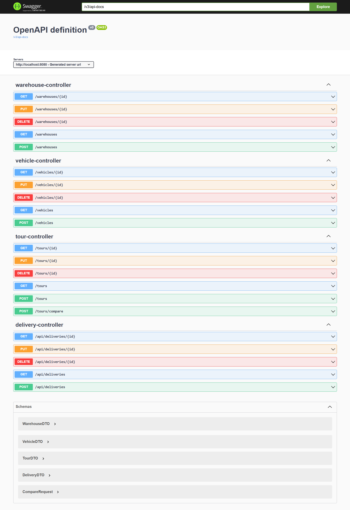
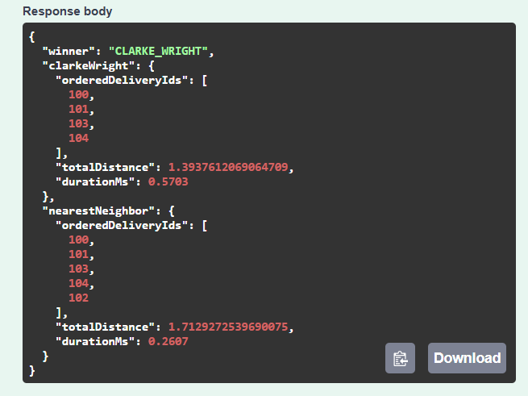

# 🚚 Delivery Tour Optimization System

📌 Project Description
Application web Spring Boot (Java 8+) pour gérer et optimiser des tournées de livraison. Elle compare deux algorithmes d’optimisation de routes: Nearest Neighbor (NN) et Clarke & Wright (CW), afin de réduire les distances parcourues et la consommation.

🎯 Main Objectives
- Gérer une flotte hétérogène (Bike, Van, Truck) avec contraintes de capacité
- Planifier et optimiser automatiquement les tournées
- Comparer NN vs CW et mesurer distance/temps d’exécution
- Calculer les distances à partir des coordonnées GPS (lat/lon)
- Exposer une API REST testable via Swagger/Postman
- Logging via SLF4J + Logback (pas de Log4j)

🔗 Useful Links
- Swagger UI: http://localhost:8080/swagger-ui/index.html
- OpenAPI JSON: http://localhost:8080/v3/api-docs
- H2 Console: http://localhost:8080/h2-console

🛠️ Technologies Used
- Java 8+ (Maven)
- Spring Boot 2.7.15 (Web, Data JPA)
- H2 Database (file)
- SLF4J + Logback (logging)
- Swagger (springdoc-openapi)
- Lombok

## Run
```bash
mvn spring-boot:run
```
- API: http://localhost:8080
- Swagger UI: http://localhost:8080/swagger-ui.html (or /swagger-ui/index.html)
- OpenAPI: http://localhost:8080/v3/api-docs
- H2 Console: http://localhost:8080/h2-console
  - JDBC: jdbc:h2:file:./data/deliveriesdb
  - user: sa, password: (empty)

## Configuration (src/main/resources/application.properties)
- spring.datasource.url=jdbc:h2:file:./data/deliveriesdb;DB_CLOSE_DELAY=-1;AUTO_SERVER=TRUE
- spring.jpa.hibernate.ddl-auto=update
- spring.jpa.defer-datasource-initialization=true
- spring.sql.init.mode=always
- spring.h2.console.enabled=true

## Seed data (executed on startup)
- File: src/main/resources/data.sql
- Creates:
  - 1 Warehouse (id=1)
  - 3 Vehicles (id=1..3): BIKE, VAN, TRUCK
  - ~20 Deliveries (id=100..119)

## Algorithms
- Nearest Neighbor: simple greedy nearest point.
- Clarke & Wright: simplified savings (tail->head merge only).
- Distance via Haversine in `DistanceCalculator`.

## Switch optimizer (XML wiring)
- File: src/main/resources/applicationContext.xml
- `tourService` constructor arg 0 can reference:
  - `clarkeWrightOptimizer` (default)
  - or `nearestNeighborOptimizer` (if defined)

## Endpoints
- Warehouse: `/warehouses` (CRUD)
- Vehicle: `/vehicles` (CRUD)
- Delivery: `/api/deliveries` (CRUD, optional PATCH status)
- Tour: `/tours` (CRUD)
- Compare NN vs CW: `POST /tours/compare`
  - Request:
    ```json
    {"warehouseId":1, "vehicleId":2, "deliveryIds":[100,101,102,103]}
    ```
  - Response: ordered ids, totalDistance, durationMs per algo, and winner.

## Validations
- Warehouse: name required; latitude [-90,90]; longitude [-180,180]; openingHours HH:mm-HH:mm in 06:00–22:00.
- Vehicle: type in {BIKE,VAN,TRUCK}; maxWeight/maxVolume/maxDeliveries > 0.
- Delivery (si activées): address required; lat/lon bounds; weight/volume > 0; timeWindow/preferredTimeSlot HH:mm-HH:mm (optional); status in {PENDING,IN_TRANSIT,DELIVERED,FAILED}.

## Error handling
- Global `@ControllerAdvice` returns JSON with: timestamp, status, error, message, path.
- Controllers also throw `ResponseStatusException` for 400/404.

## Tests (suggested)
- Unit: DistanceCalculator; NN vs CW on tiny dataset; TourService.getTotalDistance.
- Integration: CRUD flows; POST /tours/compare.

## Troubleshooting
- Empty lists after startup: ensure data.sql ran (see properties above). Check H2 tables with console.
- Swagger 404: ensure `springdoc-openapi-ui` dependency is present. Try /swagger-ui/index.html.
- 400 on /tours/compare: body must contain warehouseId and non-empty deliveryIds with existing IDs.

## Prerequisites
- JDK 8+ (Java 17 also works)
- Maven 3.6+

Verify your toolchain:
```bash
mvn -v    
java -version
```

If your IDE flags annotations like `@ControllerAdvice` as syntax errors, set language level to Java 8+ (or remove the handler if you prefer local try/catch logging only).

## Build and Run
```bash
mvn clean package
mvn spring-boot:run
```

Or run the packaged jar:
```bash
java -jar target/delivery-optimizer-1.0-SNAPSHOT.jar
```

## Quick test of /tours/compare
Example request (adjust IDs to match your data):
```bash
curl -X POST http://localhost:8080/tours/compare \
  -H "Content-Type: application/json" \
  -d '{
    "warehouseId": 1,
    "vehicleId": 2,
    "deliveryIds": [100,101,102,103]
  }'
```
Expected response (shape):
```json
{
  "clarkeWright": {"orderedDeliveryIds": [...], "totalDistance": 123.45, "durationMs": 7.2},
  "nearestNeighbor": {"orderedDeliveryIds": [...], "totalDistance": 140.01, "durationMs": 3.9},
  "winner": "CLARKE_WRIGHT"
}
```

## Logging (SLF4J + Logback, no Log4j)
- App uses SLF4J API with Spring Boot's default Logback backend.
- Configuration in `src/main/resources/application.properties`:
  - `logging.level.root=INFO`
  - `logging.level.com.delivery.optimizer=DEBUG`
  - `logging.file.path=logs` (writes to `./logs/spring.log`)
- Controller and Service log key events. You can adjust levels per package as needed.

Sample grep to see log statements in code:
```bash
grep -R "log\." -n src/main/java
```

## Screenshots
Add screenshots under a docs folder and reference them below. Suggested paths:
- `docs/screenshots/swagger-ui.png`
- `docs/screenshots/h2-console.png`
- `docs/screenshots/compare-request.png`
- `docs/screenshots/compare-response.png`

Example embeds:





## What remains / Next steps
- Ensure your IDE uses JDK 8+ (or 17) and Maven compiles with that version.
- Validate `/tours/compare` with valid/invalid payloads and watch logs in console and `./logs/spring.log`.
- Optionally remove `GlobalExceptionHandler` if you choose only local try/catch logging, or keep it once your language level is correct.
- Add unit/integration tests for the optimizers and controller.

## Project structure (key files)
- controller: WarehouseController, VehicleController, DeliveryController, TourController
- optimizer: ClarkeWrightOptimizer, TourOptimizer
- service: TourService
- util: DistanceCalculator
- dto: DTOs + CompareRequest
- mapper: Mappers
- repository: Spring Data JPA repositories


